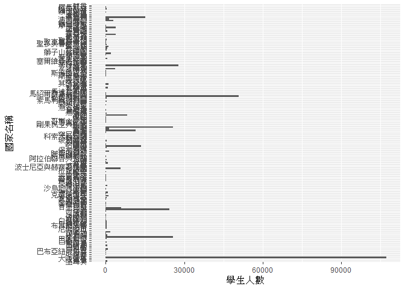
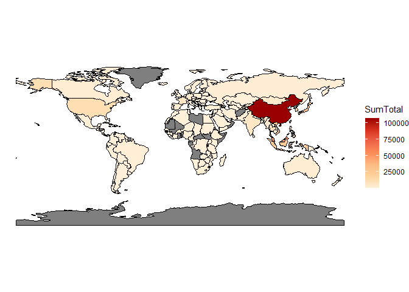
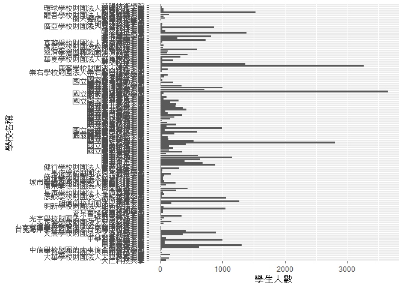
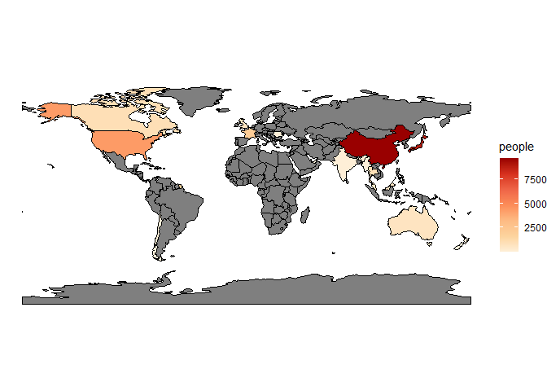
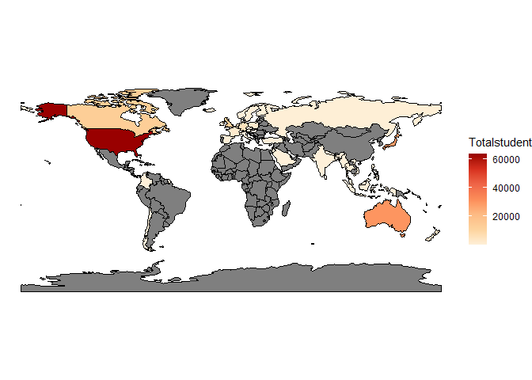
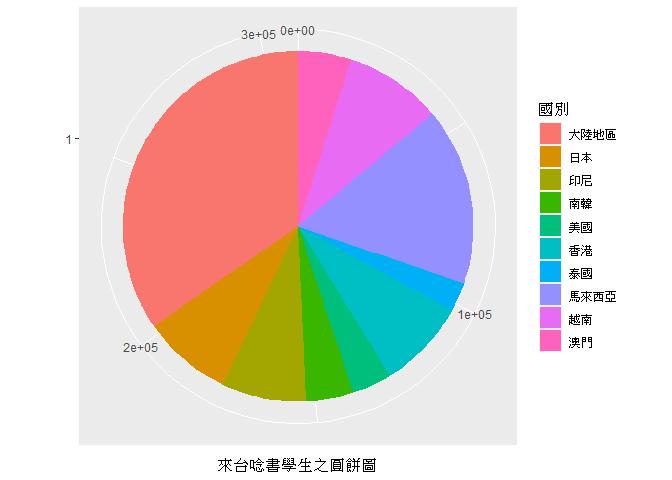
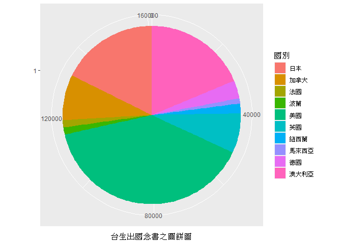

108-2 大數據分析方法 作業二
================
闕妤臻

作業完整說明[連結](https://docs.google.com/document/d/1aLGSsGXhgOVgwzSg9JdaNz2qGPQJSoupDAQownkGf_I/edit?usp=sharing)

學習再也不限定在自己出生的國家，台灣每年有許多學生選擇就讀國外的大專院校，同時也有人多國外的學生來台灣就讀，透過分析大專校院境外學生人數統計、大專校院本國學生出國進修交流數、世界各主要國家之我國留學生人數統計表可以了解各大專院校國際交流的情形。請同學分析以下議題，並以視覺化的方式呈現分析結果，呈現105-107年以後大專院校國際交流的情形
(如提供網址資料有缺少年份，可嘗試自己google一下需要年份的資料)。

## 來台境外生分析

### 資料匯入與處理

``` r
library(jsonlite)
library(dplyr)
```

    ## 
    ## Attaching package: 'dplyr'

    ## The following objects are masked from 'package:stats':
    ## 
    ##     filter, lag

    ## The following objects are masked from 'package:base':
    ## 
    ##     intersect, setdiff, setequal, union

``` r
library(readr)
library(knitr)

outsidestudent105 <- read_csv("C:/Users/chueh/OneDrive/桌面/105_ab105_C.csv")
```

    ## Parsed with column specification:
    ## cols(
    ##   洲別 = col_character(),
    ##   國別 = col_character(),
    ##   學位生_正式修讀學位外國生 = col_double(),
    ##   `學位生_僑生(含港澳)` = col_double(),
    ##   學位生_正式修讀學位陸生 = col_double(),
    ##   非學位生_外國交換生 = col_double(),
    ##   非學位生_外國短期研習及個人選讀 = col_double(),
    ##   非學位生_大專附設華語文中心學生 = col_double(),
    ##   非學位生_大陸研修生 = col_double(),
    ##   非學位生_海青班 = col_double(),
    ##   境外專班 = col_double()
    ## )

``` r
View(outsidestudent105)
outsidestudent106 <- read_csv("C:/Users/chueh/OneDrive/桌面/106_ab106_C.csv")
```

    ## Parsed with column specification:
    ## cols(
    ##   洲別 = col_character(),
    ##   國別 = col_character(),
    ##   學位生_正式修讀學位外國生 = col_number(),
    ##   `學位生_僑生(含港澳)` = col_number(),
    ##   學位生_正式修讀學位陸生 = col_number(),
    ##   非學位生_外國交換生 = col_double(),
    ##   非學位生_外國短期研習及個人選讀 = col_number(),
    ##   非學位生_大專附設華語文中心學生 = col_number(),
    ##   非學位生_大陸研修生 = col_number(),
    ##   非學位生_海青班 = col_number(),
    ##   境外專班 = col_double()
    ## )

``` r
View(outsidestudent106)
outsidestudent107<- read_csv("C:/Users/chueh/OneDrive/桌面/107_ab107_C.csv")
```

    ## Parsed with column specification:
    ## cols(
    ##   洲別 = col_character(),
    ##   國別 = col_character(),
    ##   學位生_正式修讀學位外國生 = col_double(),
    ##   `學位生_僑生(含港澳)` = col_double(),
    ##   學位生_正式修讀學位陸生 = col_double(),
    ##   非學位生_外國交換生 = col_double(),
    ##   非學位生_外國短期研習及個人選讀 = col_double(),
    ##   非學位生_大專附設華語文中心學生 = col_double(),
    ##   非學位生_大陸研修生 = col_double(),
    ##   非學位生_海青班 = col_double(),
    ##   境外專班 = col_double()
    ## )

``` r
View(outsidestudent107)

schoolstu105 <- read_csv("C:/Users/chueh/OneDrive/桌面/105_ab105_S.csv")
```

    ## Parsed with column specification:
    ## cols(
    ##   學校類型 = col_character(),
    ##   學校代碼 = col_character(),
    ##   學校名稱 = col_character(),
    ##   學位生_正式修讀學位外國生 = col_double(),
    ##   `學位生_僑生(含港澳)` = col_double(),
    ##   學位生_正式修讀學位陸生 = col_double(),
    ##   非學位生_外國交換生 = col_double(),
    ##   非學位生_外國短期研習及個人選讀 = col_double(),
    ##   非學位生_大專附設華語文中心學生 = col_double(),
    ##   非學位生_大陸研修生 = col_double(),
    ##   非學位生_海青班 = col_double(),
    ##   境外專班 = col_double()
    ## )

``` r
View(schoolstu105)
schoolstu106 <- read_csv("C:/Users/chueh/OneDrive/桌面/106_ab106_S.csv")
```

    ## Parsed with column specification:
    ## cols(
    ##   學校類型 = col_character(),
    ##   學校代碼 = col_character(),
    ##   學校名稱 = col_character(),
    ##   學位生_正式修讀學位外國生 = col_double(),
    ##   `學位生_僑生(含港澳)` = col_double(),
    ##   學位生_正式修讀學位陸生 = col_double(),
    ##   非學位生_外國交換生 = col_double(),
    ##   非學位生_外國短期研習及個人選讀 = col_double(),
    ##   非學位生_大專附設華語文中心學生 = col_double(),
    ##   非學位生_大陸研修生 = col_double(),
    ##   非學位生_海青班 = col_double(),
    ##   境外專班 = col_double()
    ## )

``` r
View(schoolstu106)
schoolstu107 <- read_csv("C:/Users/chueh/OneDrive/桌面/107_ab107_S.csv")
```

    ## Parsed with column specification:
    ## cols(
    ##   學校類型 = col_character(),
    ##   學校代碼 = col_character(),
    ##   學校名稱 = col_character(),
    ##   學位生_正式修讀學位外國生 = col_double(),
    ##   `學位生_僑生(含港澳)` = col_double(),
    ##   學位生_正式修讀學位陸生 = col_double(),
    ##   非學位生_外國交換生 = col_double(),
    ##   非學位生_外國短期研習及個人選讀 = col_double(),
    ##   非學位生_大專附設華語文中心學生 = col_double(),
    ##   非學位生_大陸研修生 = col_double(),
    ##   非學位生_海青班 = col_double(),
    ##   境外專班 = col_double()
    ## )

``` r
View(schoolstu107)
outsidestudent105[1,2]<-"大陸地區"
schoolstu105[1,2]<-"大陸地區"
outsidestudent105$Total<-rowSums(outsidestudent105[,3:11])
outsidestudent106$Total<-rowSums(outsidestudent106[,3:11])
outsidestudent107$Total<-rowSums(outsidestudent107[,3:11])
```

### 哪些國家來台灣唸書的學生最多呢？

``` r
#抓抓樂
join105106<-inner_join(outsidestudent105,outsidestudent106,by=c("洲別","國別"))
join105106107<-inner_join(join105106,outsidestudent107,by=c("洲別","國別"))
joincom<-join105106107[c(1,2,12,22,32)]
joincom$SumTotal<-rowSums(joincom[,3:5])
knitr::kable(joincom)
```

| 洲別  | 國別         | Total.x | Total.y | Total | SumTotal |
| :-- | :--------- | ------: | ------: | ----: | -------: |
| 亞洲  | 大陸地區       |   41981 |   35304 | 29960 |   107245 |
| 亞洲  | 馬來西亞       |   16311 |   17621 | 16839 |    50771 |
| 亞洲  | 香港         |    8660 |    8628 |  8432 |    25720 |
| 亞洲  | 日本         |    7542 |    8413 |  9735 |    25690 |
| 亞洲  | 澳門         |    5286 |    5137 |  4718 |    15141 |
| 亞洲  | 印尼         |    5154 |    7248 | 11841 |    24243 |
| 亞洲  | 越南         |    5342 |    8557 | 13996 |    27895 |
| 亞洲  | 南韓         |    4575 |    4565 |  4301 |    13441 |
| 亞洲  | 泰國         |    1771 |    2849 |  3575 |     8195 |
| 亞洲  | 印度         |    1293 |    2072 |  2628 |     5993 |
| 亞洲  | 蒙古         |     833 |    1402 |  1658 |     3893 |
| 亞洲  | 新加坡        |     797 |     618 |   687 |     2102 |
| 亞洲  | 緬甸         |     713 |     832 |  1314 |     2859 |
| 亞洲  | 菲律賓        |     697 |    1195 |  1722 |     3614 |
| 亞洲  | 俄羅斯        |     373 |     432 |   417 |     1222 |
| 亞洲  | 土耳其        |     192 |     189 |   206 |      587 |
| 亞洲  | 伊朗         |      62 |      74 |    83 |      219 |
| 亞洲  | 約旦         |      62 |      57 |    49 |      168 |
| 亞洲  | 以色列        |      56 |      66 |    59 |      181 |
| 亞洲  | 尼泊爾        |      46 |      94 |   134 |      274 |
| 亞洲  | 巴基斯坦       |      44 |      92 |   146 |      282 |
| 亞洲  | 汶萊         |      34 |      39 |    78 |      151 |
| 亞洲  | 孟加拉        |      19 |      25 |    41 |       85 |
| 亞洲  | 伊拉克        |      19 |      16 |    16 |       51 |
| 亞洲  | 斯里蘭卡       |      19 |      88 |    96 |      203 |
| 亞洲  | 哈薩克        |      18 |      15 |    18 |       51 |
| 亞洲  | 吉爾吉斯       |      12 |      21 |    43 |       76 |
| 亞洲  | 烏茲別克       |      12 |      13 |    12 |       37 |
| 亞洲  | 柬埔寨        |      11 |     125 |   291 |      427 |
| 亞洲  | 不丹         |       9 |      14 |    13 |       36 |
| 亞洲  | 寮國         |       9 |      41 |    32 |       82 |
| 亞洲  | 葉門         |       7 |      10 |    13 |       30 |
| 亞洲  | 塔吉克        |       7 |       5 |     8 |       20 |
| 亞洲  | 巴勒斯坦       |       5 |       9 |     9 |       23 |
| 亞洲  | 亞美尼亞       |       4 |       4 |     1 |        9 |
| 亞洲  | 沙烏地阿拉伯     |       3 |       7 |    11 |       21 |
| 亞洲  | 敘利亞        |       3 |       2 |     1 |        6 |
| 亞洲  | 土庫曼        |       3 |       6 |    11 |       20 |
| 亞洲  | 阿拉伯聯合大公國   |       2 |       4 |     3 |        9 |
| 亞洲  | 科威特        |       1 |       2 |     2 |        5 |
| 亞洲  | 摩爾多瓦       |       1 |       1 |     3 |        5 |
| 大洋洲 | 澳大利亞       |     455 |     463 |   491 |     1409 |
| 大洋洲 | 索羅門群島      |     108 |     116 |   125 |      349 |
| 大洋洲 | 紐西蘭        |      95 |     181 |    98 |      374 |
| 大洋洲 | 吉里巴斯       |      72 |      84 |   110 |      266 |
| 大洋洲 | 帛琉         |      48 |      59 |    69 |      176 |
| 大洋洲 | 吐瓦魯        |      43 |      43 |    41 |      127 |
| 大洋洲 | 馬紹爾群島共和國   |      36 |      57 |    60 |      153 |
| 大洋洲 | 諾魯         |      25 |      33 |    38 |       96 |
| 大洋洲 | 巴布亞紐幾內亞    |      21 |      32 |    35 |       88 |
| 大洋洲 | 斐濟         |       5 |       5 |    15 |       25 |
| 非洲  | 甘比亞        |     159 |     140 |    92 |      391 |
| 非洲  | 布吉納法索      |     154 |     169 |   114 |      437 |
| 非洲  | 南非         |     146 |     153 |   155 |      454 |
| 非洲  | 衣索比亞       |     110 |     161 |   182 |      453 |
| 非洲  | 聖多美普林西比    |      68 |      13 |     4 |       85 |
| 非洲  | 馬拉威        |      48 |      49 |    57 |      154 |
| 非洲  | 埃及         |      35 |      33 |    59 |      127 |
| 非洲  | 奈及利亞       |      33 |      29 |    43 |      105 |
| 非洲  | 肯亞         |      21 |      23 |    21 |       65 |
| 非洲  | 摩洛哥        |      16 |      22 |    41 |       79 |
| 非洲  | 辛巴威        |      10 |       9 |    12 |       31 |
| 非洲  | 突尼西亞       |       8 |       8 |     8 |       24 |
| 非洲  | 烏干達        |       8 |      10 |     9 |       27 |
| 非洲  | 尚比亞        |       8 |       3 |     5 |       16 |
| 非洲  | 阿爾及利亞      |       6 |       3 |     4 |       13 |
| 非洲  | 象牙海岸       |       6 |       3 |     4 |       13 |
| 非洲  | 坦尚尼亞       |       6 |      14 |    37 |       57 |
| 非洲  | 查德         |       5 |       5 |     3 |       13 |
| 非洲  | 喀麥隆        |       4 |       6 |     7 |       17 |
| 非洲  | 剛果         |       4 |       8 |     6 |       18 |
| 非洲  | 模里西斯       |       4 |       7 |     1 |       12 |
| 非洲  | 塞內加爾       |       4 |       3 |     4 |       11 |
| 非洲  | 莫三比克       |       3 |       5 |     5 |       13 |
| 非洲  | 蘇丹         |       3 |       2 |     2 |        7 |
| 非洲  | 剛果民主共和國    |       3 |       4 |     4 |       11 |
| 非洲  | 索馬利蘭共和國    |       3 |       3 |     4 |       10 |
| 非洲  | 盧安達        |       2 |       3 |     1 |        6 |
| 非洲  | 獅子山共和國     |       2 |       1 |     3 |        6 |
| 非洲  | 納米比亞       |       2 |       1 |     1 |        4 |
| 非洲  | 波札那        |       1 |       6 |     6 |       13 |
| 非洲  | 幾內亞        |       1 |       1 |     1 |        3 |
| 非洲  | 賴比瑞亞       |       1 |       3 |     1 |        5 |
| 非洲  | 馬達加斯加      |       1 |       3 |     1 |        5 |
| 非洲  | 尼日         |       1 |       1 |     1 |        3 |
| 歐洲  | 法國         |    1681 |    1859 |  2117 |     5657 |
| 歐洲  | 德國         |    1148 |    1283 |  1326 |     3757 |
| 歐洲  | 英國         |     442 |     440 |   453 |     1335 |
| 歐洲  | 荷蘭         |     390 |     356 |   390 |     1136 |
| 歐洲  | 西班牙        |     370 |     337 |   346 |     1053 |
| 歐洲  | 義大利        |     329 |     307 |   400 |     1036 |
| 歐洲  | 捷克         |     275 |     312 |   290 |      877 |
| 歐洲  | 波蘭         |     224 |     286 |   281 |      791 |
| 歐洲  | 瑞典         |     209 |     284 |   220 |      713 |
| 歐洲  | 奧地利        |     205 |     201 |   173 |      579 |
| 歐洲  | 比利時        |     162 |     205 |   211 |      578 |
| 歐洲  | 瑞士         |     123 |     114 |   168 |      405 |
| 歐洲  | 芬蘭         |     108 |     125 |   132 |      365 |
| 歐洲  | 匈牙利        |      87 |      70 |    65 |      222 |
| 歐洲  | 丹麥         |      71 |      80 |    69 |      220 |
| 歐洲  | 烏克蘭        |      71 |      73 |    68 |      212 |
| 歐洲  | 斯洛伐克       |      63 |      71 |    67 |      201 |
| 歐洲  | 葡萄牙        |      59 |      61 |    60 |      180 |
| 歐洲  | 愛爾蘭        |      44 |      44 |    46 |      134 |
| 歐洲  | 挪威         |      43 |      41 |    55 |      139 |
| 歐洲  | 立陶宛        |      27 |      23 |    28 |       78 |
| 歐洲  | 羅馬尼亞       |      23 |      19 |    18 |       60 |
| 歐洲  | 白俄羅斯       |      21 |      17 |    18 |       56 |
| 歐洲  | 斯洛維尼亞      |      20 |      30 |    15 |       65 |
| 歐洲  | 克羅埃西亞      |      15 |      14 |    18 |       47 |
| 歐洲  | 愛沙尼亞       |      15 |       8 |     5 |       28 |
| 歐洲  | 拉脫維亞       |      14 |       6 |    15 |       35 |
| 歐洲  | 希臘         |      12 |      17 |     8 |       37 |
| 歐洲  | 保加利亞       |      10 |       8 |     6 |       24 |
| 歐洲  | 塞爾維亞共和國    |       8 |       6 |     8 |       22 |
| 歐洲  | 盧森堡        |       7 |      11 |     9 |       27 |
| 歐洲  | 波士尼亞與赫塞哥維納 |       4 |       2 |     2 |        8 |
| 歐洲  | 阿爾巴尼亞      |       2 |       2 |     5 |        9 |
| 歐洲  | 馬爾他        |       2 |       1 |     3 |        6 |
| 歐洲  | 冰島         |       1 |       8 |     5 |       14 |
| 歐洲  | 科索沃共和國     |       1 |       4 |     6 |       11 |
| 美洲  | 美國         |    3701 |    3868 |  3816 |    11385 |
| 美洲  | 加拿大        |     624 |     591 |   608 |     1823 |
| 美洲  | 宏都拉斯       |     280 |     336 |   291 |      907 |
| 美洲  | 巴西         |     268 |     237 |   375 |      880 |
| 美洲  | 墨西哥        |     237 |     216 |   220 |      673 |
| 美洲  | 巴拉圭        |     192 |     189 |   251 |      632 |
| 美洲  | 巴拿馬        |     191 |     163 |   108 |      462 |
| 美洲  | 貝里斯        |     184 |     229 |   237 |      650 |
| 美洲  | 薩爾瓦多       |     164 |     195 |   108 |      467 |
| 美洲  | 尼加拉瓜       |     158 |     152 |   177 |      487 |
| 美洲  | 海地         |     152 |     163 |   178 |      493 |
| 美洲  | 瓜地馬拉       |     124 |     146 |   146 |      416 |
| 美洲  | 聖露西亞       |     109 |     118 |   117 |      344 |
| 美洲  | 聖文森        |      88 |     117 |   123 |      328 |
| 美洲  | 厄瓜多        |      84 |      74 |    80 |      238 |
| 美洲  | 多明尼加       |      79 |      91 |    74 |      244 |
| 美洲  | 聖克里斯多福     |      77 |      84 |    85 |      246 |
| 美洲  | 秘魯         |      64 |      65 |    84 |      213 |
| 美洲  | 阿根廷        |      58 |      63 |    68 |      189 |
| 美洲  | 哥倫比亞       |      53 |      78 |    79 |      210 |
| 美洲  | 智利         |      33 |      43 |    39 |      115 |
| 美洲  | 哥斯大黎加      |      23 |      20 |    17 |       60 |
| 美洲  | 委內瑞拉       |      19 |      20 |    13 |       52 |
| 美洲  | 玻利維亞       |      12 |      16 |    13 |       41 |
| 美洲  | 烏拉圭        |       7 |       4 |     6 |       17 |
| 美洲  | 巴哈馬        |       2 |       4 |     1 |        7 |
| 美洲  | 巴貝多        |       2 |       1 |     1 |        4 |
| 美洲  | 蓋亞那        |       2 |       2 |     2 |        6 |
| 美洲  | 多米尼克       |       1 |       1 |     1 |        3 |

``` r
View(joincom)

names(joincom)[3]<-"105總Total"
names(joincom)[4]<-"106總Total"
names(joincom)[5]<-"107總Total"
joincomplete<-head(joincom[order(joincom$SumTotal,decreasing=T),],10)
knitr::kable(joincomplete)
```

| 洲別 | 國別   | 105總Total | 106總Total | 107總Total | SumTotal |
| :- | :--- | :-------: | :-------: | :-------: | -------: |
| 亞洲 | 大陸地區 |   41981   |   35304   |   29960   |   107245 |
| 亞洲 | 馬來西亞 |   16311   |   17621   |   16839   |    50771 |
| 亞洲 | 越南   |   5342    |   8557    |   13996   |    27895 |
| 亞洲 | 香港   |   8660    |   8628    |   8432    |    25720 |
| 亞洲 | 日本   |   7542    |   8413    |   9735    |    25690 |
| 亞洲 | 印尼   |   5154    |   7248    |   11841   |    24243 |
| 亞洲 | 澳門   |   5286    |   5137    |   4718    |    15141 |
| 亞洲 | 南韓   |   4575    |   4565    |   4301    |    13441 |
| 美洲 | 美國   |   3701    |   3868    |   3816    |    11385 |
| 亞洲 | 泰國   |   1771    |   2849    |   3575    |     8195 |

``` r
View(joincomplete)
```

### 哪間大學的境外生最多呢？

``` r
schoolstu105[1,2]<-"0001"
schoolstu105$Total<-rowSums(schoolstu105[,4:12])
schoolstu106$Total<-rowSums(schoolstu106[,4:12])
schoolstu107$Total<-rowSums(schoolstu107[,4:12])
bine105106<-inner_join(schoolstu105,schoolstu106,by=c("學校類型","學校名稱"))
bine105106107<-inner_join(bine105106,schoolstu107,by=c("學校類型","學校名稱"))
binecom<-bine105106107[c(1,3,13,24,35)]
binecom$SumTotal<-rowSums(binecom[,3:5])
knitr::kable(binecom)
```

| 學校類型   | 學校名稱        | Total.x | Total.y | Total | SumTotal |
| :----- | :---------- | ------: | ------: | ----: | -------: |
| 大專校院   | 國立政治大學      |    2989 |    3004 |  3027 |     9020 |
| 大專校院   | 國立清華大學      |    1149 |    1770 |  2035 |     4954 |
| 大專校院   | 國立臺灣大學      |    4817 |    4877 |  4808 |    14502 |
| 大專校院   | 國立臺灣師範大學    |    5709 |    6541 |  6251 |    18501 |
| 大專校院   | 國立臺灣師大僑生先修部 |     850 |     588 |   497 |     1935 |
| 大專校院   | 國立成功大學      |    2864 |    3253 |  3292 |     9409 |
| 大專校院   | 國立中興大學      |    1027 |    1164 |  1178 |     3369 |
| 大專校院   | 國立交通大學      |    1921 |    2083 |  2134 |     6138 |
| 大專校院   | 國立中央大學      |    1046 |    1146 |  1317 |     3509 |
| 大專校院   | 國立中山大學      |    1450 |    1283 |  1630 |     4363 |
| 大專校院   | 國立臺灣海洋大學    |     460 |     614 |  1586 |     2660 |
| 大專校院   | 國立中正大學      |     693 |     825 |   792 |     2310 |
| 大專校院   | 國立高雄師範大學    |     618 |     581 |   508 |     1707 |
| 大專校院   | 國立彰化師範大學    |     385 |     537 |   532 |     1454 |
| 大專校院   | 國立陽明大學      |     329 |     366 |   422 |     1117 |
| 大專校院   | 國立臺北大學      |     409 |     440 |   485 |     1334 |
| 大專校院   | 國立嘉義大學      |     662 |     709 |   915 |     2286 |
| 大專校院   | 國立高雄大學      |     280 |     262 |   357 |      899 |
| 大專校院   | 國立東華大學      |     666 |     743 |   881 |     2290 |
| 大專校院   | 國立暨南國際大學    |     736 |     773 |   836 |     2345 |
| 大專校院   | 國立臺灣科技大學    |    1237 |    1552 |  1732 |     4521 |
| 大專校院   | 國立雲林科技大學    |     433 |     508 |   741 |     1682 |
| 大專校院   | 國立屏東科技大學    |     836 |     890 |   910 |     2636 |
| 大專校院   | 國立臺北科技大學    |     838 |    1119 |  1276 |     3233 |
| 大專校院   | 國立臺北藝術大學    |     246 |     272 |   286 |      804 |
| 大專校院   | 國立臺灣藝術大學    |     256 |     289 |   301 |      846 |
| 大專校院   | 國立臺東大學      |     119 |     252 |    92 |      463 |
| 大專校院   | 國立宜蘭大學      |     185 |     266 |   215 |      666 |
| 大專校院   | 國立聯合大學      |     253 |     201 |   234 |      688 |
| 大專校院   | 國立虎尾科技大學    |     111 |     155 |   235 |      501 |
| 大專校院   | 國立臺南藝術大學    |      32 |      39 |    54 |      125 |
| 大專校院   | 國立臺南大學      |     178 |     165 |   142 |      485 |
| 大專校院   | 國立臺北教育大學    |     802 |     877 |  1044 |     2723 |
| 大專校院   | 國立臺中教育大學    |     570 |     521 |   589 |     1680 |
| 大專校院   | 國立澎湖科技大學    |      52 |      48 |    47 |      147 |
| 大專校院   | 國立勤益科技大學    |     124 |     229 |   645 |      998 |
| 大專校院   | 國立體育大學      |     121 |     131 |   160 |      412 |
| 大專校院   | 國立臺北護理健康大學  |     202 |     317 |   301 |      820 |
| 大專校院   | 國立高雄餐旅大學    |     295 |     325 |   329 |      949 |
| 大專校院   | 國立金門大學      |     211 |     200 |   184 |      595 |
| 大專校院   | 國立臺灣體育運動大學  |      97 |     112 |   106 |      315 |
| 大專校院   | 國立臺中科技大學    |     161 |     167 |   171 |      499 |
| 大專校院   | 國立臺北商業大學    |     217 |     248 |   278 |      743 |
| 大專校院   | 國立屏東大學      |     237 |     363 |   497 |     1097 |
| 大專校院   | 國立臺灣戲曲學院    |      15 |     101 |    20 |      136 |
| 大專校院   | 東海大學        |    1648 |    1808 |  1784 |     5240 |
| 大專校院   | 輔仁大學        |    2518 |    2455 |  2170 |     7143 |
| 大專校院   | 東吳大學        |    1193 |    1219 |  1171 |     3583 |
| 大專校院   | 中原大學        |    1995 |    2924 |  3084 |     8003 |
| 大專校院   | 淡江大學        |    3727 |    3919 |  4257 |    11903 |
| 大專校院   | 中國文化大學      |    4046 |    3707 |  3386 |    11139 |
| 大專校院   | 逢甲大學        |    2440 |    2620 |  2956 |     8016 |
| 大專校院   | 靜宜大學        |    1574 |    1524 |  1710 |     4808 |
| 大專校院   | 長庚大學        |     523 |     513 |   618 |     1654 |
| 大專校院   | 元智大學        |     984 |     927 |   930 |     2841 |
| 大專校院   | 中華大學        |     333 |     436 |   548 |     1317 |
| 大專校院   | 大葉大學        |     668 |     919 |   871 |     2458 |
| 大專校院   | 華梵大學        |      72 |      76 |    89 |      237 |
| 大專校院   | 義守大學        |    1777 |    2136 |  2175 |     6088 |
| 大專校院   | 世新大學        |     996 |     995 |   931 |     2922 |
| 大專校院   | 銘傳大學        |    4159 |    3847 |  4114 |    12120 |
| 大專校院   | 實踐大學        |    1358 |    1590 |  2155 |     5103 |
| 大專校院   | 朝陽科技大學      |     631 |     664 |   804 |     2099 |
| 大專校院   | 高雄醫學大學      |     563 |     593 |   520 |     1676 |
| 大專校院   | 南華大學        |     287 |     885 |  1595 |     2767 |
| 大專校院   | 真理大學        |     102 |     102 |    82 |      286 |
| 大專校院   | 大同大學        |     153 |     166 |   170 |      489 |
| 大專校院   | 南臺科技大學      |     752 |    1045 |  1088 |     2885 |
| 大專校院   | 崑山科技大學      |     614 |     686 |   684 |     1984 |
| 大專校院   | 嘉南藥理大學      |      77 |     197 |   200 |      474 |
| 大專校院   | 樹德科技大學      |     586 |     724 |  1138 |     2448 |
| 大專校院   | 慈濟大學        |     603 |     873 |   847 |     2323 |
| 大專校院   | 臺北醫學大學      |    1024 |    1244 |  1232 |     3500 |
| 大專校院   | 中山醫學大學      |     365 |     390 |   456 |     1211 |
| 大專校院   | 龍華科技大學      |     515 |     688 |   926 |     2129 |
| 大專校院   | 輔英科技大學      |     139 |     223 |   385 |      747 |
| 大專校院   | 明新科技大學      |     127 |     399 |  1226 |     1752 |
| 大專校院   | 長榮大學        |     432 |     508 |   777 |     1717 |
| 大專校院   | 弘光科技大學      |     574 |     652 |   689 |     1915 |
| 大專校院   | 中國醫藥大學      |     664 |     782 |   822 |     2268 |
| 大專校院   | 健行科技大學      |      32 |      80 |   726 |      838 |
| 大專校院   | 正修科技大學      |     161 |     499 |   547 |     1207 |
| 大專校院   | 萬能科技大學      |     391 |     424 |   472 |     1287 |
| 大專校院   | 玄奘大學        |     329 |     311 |   256 |      896 |
| 大專校院   | 建國科技大學      |     337 |     574 |   633 |     1544 |
| 大專校院   | 明志科技大學      |     103 |     119 |   132 |      354 |
| 大專校院   | 高苑科技大學      |      47 |      73 |   508 |      628 |
| 大專校院   | 大仁科技大學      |     140 |     133 |   139 |      412 |
| 大專校院   | 聖約翰科技大學     |     200 |     247 |   335 |      782 |
| 大專校院   | 嶺東科技大學      |     168 |     158 |   122 |      448 |
| 大專校院   | 中國科技大學      |     167 |     175 |   257 |      599 |
| 大專校院   | 中臺科技大學      |     159 |     224 |   211 |      594 |
| 大專校院   | 亞洲大學        |     613 |     900 |  1179 |     2692 |
| 大專校院   | 開南大學        |     771 |    1452 |  1786 |     4009 |
| 大專校院   | 佛光大學        |     343 |     420 |   405 |     1168 |
| 大專校院   | 台南應用科技大學    |      98 |     111 |   118 |      327 |
| 大專校院   | 遠東科技大學      |      64 |     121 |   140 |      325 |
| 大專校院   | 元培醫事科技大學    |     242 |     252 |   376 |      870 |
| 大專校院   | 景文科技大學      |     199 |     300 |   418 |      917 |
| 大專校院   | 中華醫事科技大學    |      70 |      32 |   355 |      457 |
| 大專校院   | 東南科技大學      |     117 |     124 |   328 |      569 |
| 大專校院   | 德明財經科技大學    |     210 |     211 |   341 |      762 |
| 大專校院   | 明道大學        |     402 |     711 |   915 |     2028 |
| 大專校院   | 南開科技大學      |     151 |     153 |   292 |      596 |
| 大專校院   | 中華科技大學      |      39 |      37 |    31 |      107 |
| 大專校院   | 僑光科技大學      |      37 |     111 |   180 |      328 |
| 大專校院   | 育達科技大學      |      65 |      37 |   396 |      498 |
| 大專校院   | 美和科技大學      |     205 |     317 |   378 |      900 |
| 大專校院   | 吳鳳科技大學      |     100 |      68 |    37 |      205 |
| 大專校院   | 環球科技大學      |     599 |     589 |   642 |     1830 |
| 大專校院   | 台灣首府大學      |     209 |     217 |   500 |      926 |
| 大專校院   | 中州科技大學      |     102 |     161 |   131 |      394 |
| 大專校院   | 修平科技大學      |      29 |      32 |    98 |      159 |
| 大專校院   | 長庚科技大學      |      67 |      95 |    90 |      252 |
| 大專校院   | 臺北城市科技大學    |      85 |      60 |    84 |      229 |
| 大專校院   | 大華科技大學      |     127 |     145 |   118 |      390 |
| 大專校院   | 醒吾科技大學      |      75 |     246 |   647 |      968 |
| 大專校院   | 南榮科技大學      |      62 |      48 |    15 |      125 |
| 大專校院   | 文藻外語大學      |     632 |     854 |  1300 |     2786 |
| 大專校院   | 華夏科技大學      |      15 |      18 |   108 |      141 |
| 大專校院   | 慈濟科技大學      |     105 |     180 |   225 |      510 |
| 大專校院   | 致理科技大學      |      59 |     157 |   175 |      391 |
| 大專校院   | 康寧大學        |      28 |      99 |    66 |      193 |
| 大專校院   | 中信金融管理學院    |       4 |       6 |    26 |       36 |
| 大專校院   | 大漢技術學院      |       4 |       4 |     1 |        9 |
| 大專校院   | 和春技術學院      |      67 |      99 |    65 |      231 |
| 大專校院   | 亞東技術學院      |       6 |       7 |     5 |       18 |
| 大專校院   | 南亞技術學院      |      32 |      26 |    17 |       75 |
| 大專校院   | 稻江科技暨管理學院   |       7 |       3 |     1 |       11 |
| 大專校院   | 蘭陽技術學院      |       5 |       5 |     2 |       12 |
| 大專校院   | 黎明技術學院      |      13 |      91 |   293 |      397 |
| 大專校院   | 經國管理暨健康學院   |      15 |      70 |   115 |      200 |
| 大專校院   | 大同技術學院      |       4 |       8 |    25 |       37 |
| 大專校院   | 臺灣觀光學院      |      15 |       9 |     6 |       30 |
| 大專校院   | 馬偕醫學院       |       6 |      21 |    23 |       50 |
| 大專校院   | 法鼓文理學院      |      46 |      49 |    43 |      138 |
| 大專校院   | 馬偕醫護管理專科學校  |       1 |       1 |     2 |        4 |
| 大專校院   | 樹人醫護管理專科學校  |      34 |      20 |    79 |      133 |
| 大專校院   | 耕莘健康管理專科學校  |       2 |       1 |     1 |        4 |
| 大專校院   | 新生醫護管理專科學校  |       2 |       2 |     2 |        6 |
| 大專校院   | 臺北市立大學      |     210 |     237 |   286 |      733 |
| 無      | 無法區分校別      |   32648 |   25824 | 20597 |    79069 |
| 宗教研修學院 | 基督教台灣浸會神學院  |       1 |       1 |     1 |        3 |
| 宗教研修學院 | 臺北基督學院      |      10 |      12 |     9 |       31 |
| 軍警大專校院 | 國防醫學院       |      98 |     108 |   124 |      330 |

``` r
View(binecom)

names(binecom)[3]<-"105總Total"
names(binecom)[4]<-"106總Total"
names(binecom)[5]<-"107總Total"
binecomplete<-head(binecom[order(binecom$SumTotal,decreasing=T),],11)
knitr::kable(binecomplete)
```

| 學校類型 | 學校名稱     | 105總Total | 106總Total | 107總Total | SumTotal |
| :--- | :------- | :-------: | :-------: | :-------: | -------: |
| 無    | 無法區分校別   |   32648   |   25824   |   20597   |    79069 |
| 大專校院 | 國立臺灣師範大學 |   5709    |   6541    |   6251    |    18501 |
| 大專校院 | 國立臺灣大學   |   4817    |   4877    |   4808    |    14502 |
| 大專校院 | 銘傳大學     |   4159    |   3847    |   4114    |    12120 |
| 大專校院 | 淡江大學     |   3727    |   3919    |   4257    |    11903 |
| 大專校院 | 中國文化大學   |   4046    |   3707    |   3386    |    11139 |
| 大專校院 | 國立成功大學   |   2864    |   3253    |   3292    |     9409 |
| 大專校院 | 國立政治大學   |   2989    |   3004    |   3027    |     9020 |
| 大專校院 | 逢甲大學     |   2440    |   2620    |   2956    |     8016 |
| 大專校院 | 中原大學     |   1995    |   2924    |   3084    |     8003 |
| 大專校院 | 輔仁大學     |   2518    |   2455    |   2170    |     7143 |

``` r
View(binecomplete)
```

### 各個國家來台灣唸書的學生人數長條圖

``` r
library(ggplot2) 
joincomplot<-ggplot()+
  geom_bar(data = joincom,
           aes(x=SumTotal,y=國別),
           stat = "identity")+
  labs(x="學生人數",y="國家名稱")
joincomplot
```

<!-- -->

### 各個國家來台灣唸書的學生人數面量圖

``` r
library(maptools)
```

    ## Loading required package: sp

    ## Checking rgeos availability: FALSE
    ##      Note: when rgeos is not available, polygon geometry     computations in maptools depend on gpclib,
    ##      which has a restricted licence. It is disabled by default;
    ##      to enable gpclib, type gpclibPermit()

``` r
#讀取shapefile
worldMap<-readShapeSpatial("ne_110m_admin_0_countries/ne_110m_admin_0_countries.shp")
```

    ## Warning: readShapeSpatial is deprecated; use rgdal::readOGR or sf::st_read

    ## Warning: readShapePoly is deprecated; use rgdal::readOGR or sf::st_read

``` r
#shapefile轉為data.frame
worldMap.df<-fortify(worldMap)
```

    ## Regions defined for each Polygons

``` r
#字串轉數字
worldMap.df$id<-as.numeric(worldMap.df$id)
#建立mydata，包含地區名稱、地區ISO3碼、地區id
mydata<-
  data.frame(Name=worldMap$NAME_LONG,ISO3=worldMap$ISO_A3,id=seq(0,length(worldMap$ISO_A3)-1))
#因子轉字串和補遺漏值
mydata$ISO3<-as.character(mydata$ISO3)
mydata$ISO3[56]<-"FRA"
mydata$ISO3[119]<-"NOR"

#地圖資料合併mydata(以id為依據，新增地圖名稱欄位、地區ISO3碼欄位)
worldMap.df<-left_join(worldMap.df,mydata,by="id")
#讀取國家中英對照表
countryName<-fromJSON("countries.json")
#國家中英對照表處理(對照表和開放資料的中文地區名稱不一致，以開放資料的地區名稱為依據，修改對照表的地區名稱)
index<-c(2,13,17,40,48,55,73,98,119,120,122,143,153,160,166,177,191,195,199,204,207,209,227,228,229,238)
Name<-c("阿拉伯聯合大公國","澳大利亞","波士尼亞與赫塞哥維納","剛果民主共和國","大陸地區","賽普勒斯","密克羅尼西亞",
        "克羅埃西亞","葛摩聯盟","聖克里斯多福","南韓","馬紹爾群島共和國","馬爾他","納米比亞","納戈爾諾-卡拉巴赫",
        "巴布亞紐幾內亞","塞爾維亞共和國","索羅門群島","新加坡","獅子山共和國","索馬利亞民主共和國","南蘇丹共和國",
        "千里達","吐瓦魯","臺灣","聖文森")
countryName$Taiwan[index]<-Name

#地區資料合併國家中英對照表(以ISO3碼為依據，主要目的為新增中文地區名稱欄位)
worldMap.df<-left_join(worldMap.df,countryName,by="ISO3")
#地區資料選取會用到的欄位
worldMap.df<-worldMap.df%>%
  select(long:ISO3,Taiwan)
#欄位名稱處理
colnames(worldMap.df)[10]<-"國別" 
#地區資料合併開放資料為最終資料(以國別為依據，新增總人數欄位)
final.data<-left_join(worldMap.df,joincom,by="國別")

library(RColorBrewer)
othercountryTW<-ggplot()+
  geom_polygon(data=final.data,aes(x=long,y=lat,group=group,fill=SumTotal),color="black",size=0.25)+
  coord_quickmap()+
  scale_fill_gradientn(colours=brewer.pal(7,"OrRd"))+
  theme_void()

othercountryTW
```

<!-- -->

## 台灣學生國際交流分析

### 資料匯入與處理

``` r
lightstu <- read_csv("C:/Users/chueh/OneDrive/桌面/lightstu.csv")
```

    ## Parsed with column specification:
    ## cols(
    ##   學年度 = col_double(),
    ##   學期 = col_double(),
    ##   設立別 = col_character(),
    ##   學校類別 = col_character(),
    ##   學校統計處代碼 = col_character(),
    ##   學校名稱 = col_character(),
    ##   系所代碼 = col_character(),
    ##   系所名稱 = col_character(),
    ##   `學制班別(日間)` = col_character(),
    ##   `進修交流國家(地區)別` = col_character(),
    ##   `進修交流國家(地區)區域別` = col_character(),
    ##   `本國學生出國進修交流至少1學期(修讀學分)以上人數小計` = col_double(),
    ##   `本國學生出國進修交流至少1學期(修讀學分)以上人數男` = col_double(),
    ##   `本國學生出國進修交流至少1學期(修讀學分)以上人數女` = col_double(),
    ##   `本國學生出國進修交流未滿1學期(修讀學分)人數小計` = col_double(),
    ##   `本國學生出國進修交流未滿1學期(修讀學分)人數男` = col_double(),
    ##   `本國學生出國進修交流未滿1學期(修讀學分)人數女` = col_double()
    ## )

``` r
View(lightstu)
```

### 台灣大專院校的學生最喜歡去哪些國家進修交流呢？

``` r
lightstu$sumpeope<-
  lightstu$`本國學生出國進修交流至少1學期(修讀學分)以上人數小計`+lightstu$`本國學生出國進修交流未滿1學期(修讀學分)人數小計`
View(lightstu)
lightstu_country<-
  group_by(lightstu,`進修交流國家(地區)別`)%>%
  summarise(people=sum(sumpeope))
View(lightstu_country)
names(lightstu_country)[1]<-"國別"
lightstu_country_top10<-
  head(lightstu_country[order(lightstu_country$people,decreasing = T),],10)
View(lightstu_country_top10)
knitr::kable(lightstu_country_top10)
```

| 國別       | people |
| :------- | -----: |
| 大陸地區     |   9690 |
| 日本       |   8813 |
| 美國       |   4366 |
| 大韓民國(南韓) |   4150 |
| 德意志聯邦共和國 |   2943 |
| 法國       |   2037 |
| 西班牙王國    |   1364 |
| 加拿大      |    951 |
| 泰國       |    924 |
| 荷蘭王國     |    819 |

### 哪間大學的出國交流學生數最多呢？

``` r
lightstu_school<-
  group_by(lightstu,學校名稱)%>%
  summarise(people=sum(sumpeope))
View(lightstu_school)
lightstu_school_top10<-head(lightstu_school[order(lightstu_school$people,decreasing = T),],10)
View(lightstu_school_top10)
knitr::kable(lightstu_school_top10)
```

| 學校名稱   | people |
| :----- | -----: |
| 國立臺灣大學 |   3657 |
| 淡江大學   |   3271 |
| 國立政治大學 |   2804 |
| 靜宜大學   |   1529 |
| 輔仁大學   |   1383 |
| 逢甲大學   |   1368 |
| 中國文化大學 |   1302 |
| 東吳大學   |   1262 |
| 國立交通大學 |   1150 |
| 東海大學   |   1054 |

### 台灣大專院校的學生最喜歡去哪些國家進修交流條狀圖

``` r
library(ggplot2) 
lightstu_schoolplot<-ggplot()+
  geom_bar(data = lightstu_school,
           aes(x=people,y=學校名稱),
           stat = "identity")+
  labs(x="學生人數",y="學校名稱")
lightstu_schoolplot
```

<!-- -->

### 台灣大專院校的學生最喜歡去哪些國家進修交流面量圖

``` r
library(maptools)
#讀取shapefile
worldMap<-readShapeSpatial("ne_110m_admin_0_countries/ne_110m_admin_0_countries.shp")
```

    ## Warning: readShapeSpatial is deprecated; use rgdal::readOGR or sf::st_read

    ## Warning: readShapePoly is deprecated; use rgdal::readOGR or sf::st_read

``` r
#shapefile轉為data.frame
worldMap.df<-fortify(worldMap)
```

    ## Regions defined for each Polygons

``` r
#字串轉數字
worldMap.df$id<-as.numeric(worldMap.df$id)
#建立mydata，包含地區名稱、地區ISO3碼、地區id
mydata<-data.frame(Name=worldMap$NAME_LONG,ISO3=worldMap$ISO_A3,id=seq(0,length(worldMap$ISO_A3)-1))
#因子轉字串和補遺漏值
mydata$ISO3<-as.character(mydata$ISO3)
mydata$ISO3[56]<-"FRA"
mydata$ISO3[119]<-"NOR"

#地圖資料合併mydata(以id為依據，新增地圖名稱欄位、地區ISO3碼欄位)
worldMap.df<-left_join(worldMap.df,mydata,by="id")
#讀取國家中英對照表
countryName<-fromJSON("countries.json")
#國家中英對照表處理(對照表和開放資料的中文地區名稱不一致，以開放資料的地區名稱為依據，修改對照表的地區名稱)
index<-c(2,13,17,40,48,55,73,98,119,120,122,143,153,160,166,177,191,195,199,204,207,209,227,228,229,238)
Name<-c("阿拉伯聯合大公國","澳大利亞","波士尼亞與赫塞哥維納","剛果民主共和國","大陸地區","賽普勒斯","密克羅尼西亞",
        "克羅埃西亞","葛摩聯盟","聖克里斯多福","南韓","馬紹爾群島共和國","馬爾他","納米比亞","納戈爾諾-卡拉巴赫",
        "巴布亞紐幾內亞","塞爾維亞共和國","索羅門群島","新加坡","獅子山共和國","索馬利亞民主共和國","南蘇丹共和國",
        "千里達","吐瓦魯","臺灣","聖文森")
countryName$Taiwan[index]<-Name

#地區資料合併國家中英對照表(以ISO3碼為依據，主要目的為新增中文地區名稱欄位)
worldMap.df<-left_join(worldMap.df,countryName,by="ISO3")
#地區資料選取會用到的欄位
worldMap.df<-worldMap.df%>%
  select(long:ISO3,Taiwan)
#欄位名稱處理
colnames(worldMap.df)[10]<-"國別" 
#地區資料合併開放資料為最終資料(以國別為依據，新增總人數欄位)
final.data<-left_join(worldMap.df,lightstu_country,by="國別")

library(RColorBrewer)
lightstu_countryTWmap<-ggplot()+
  geom_polygon(data=final.data,aes(x=long,y=lat,group=group,fill=people),color="black",size=0.25)+
  coord_quickmap()+
  scale_fill_gradientn(colours=brewer.pal(7,"OrRd"))+
  theme_void()

lightstu_countryTWmap
```

<!-- -->

## 台灣學生出國留學分析

### 資料匯入與處理

``` r
studyabroad <- read_csv("C:/Users/chueh/OneDrive/桌面/studyabroad.csv")
```

    ## Parsed with column specification:
    ## cols(
    ##   年度 = col_double(),
    ##   洲別 = col_character(),
    ##   國別 = col_character(),
    ##   總人數 = col_number()
    ## )

``` r
View(studyabroad)
```

### 台灣學生最喜歡去哪些國家留學呢？

``` r
studyabroadcountry<-group_by(studyabroad,國別,洲別)%>%
  summarise(Totalstudent=sum(總人數))
stuabcomplete<-
  head(studyabroadcountry[order(studyabroadcountry$Totalstudent,decreasing=T),],10)
knitr::kable(stuabcomplete)
```

| 國別   | 洲別  | Totalstudent |
| :--- | :-- | -----------: |
| 美國   | 美洲  |        63770 |
| 澳大利亞 | 大洋洲 |        30155 |
| 日本   | 亞洲  |        28433 |
| 加拿大  | 美洲  |        13359 |
| 英國   | 歐洲  |        11510 |
| 德國   | 歐洲  |         5256 |
| 紐西蘭  | 大洋洲 |         2926 |
| 法國   | 歐洲  |         2083 |
| 波蘭   | 歐洲  |         2077 |
| 馬來西亞 | 亞洲  |         1513 |

``` r
View(stuabcomplete)
```

### 台灣學生最喜歡去哪些國家留學面量圖

``` r
library(maptools)
#讀取shapefile
worldMap<-readShapeSpatial("ne_110m_admin_0_countries/ne_110m_admin_0_countries.shp")
```

    ## Warning: readShapeSpatial is deprecated; use rgdal::readOGR or sf::st_read

    ## Warning: readShapePoly is deprecated; use rgdal::readOGR or sf::st_read

``` r
#shapefile轉為data.frame
worldMap.df<-fortify(worldMap)
```

    ## Regions defined for each Polygons

``` r
#字串轉數字
worldMap.df$id<-as.numeric(worldMap.df$id)
#建立mydata，包含地區名稱、地區ISO3碼、地區id
mydata<-
  data.frame(Name=worldMap$NAME_LONG,ISO3=worldMap$ISO_A3,id=seq(0,length(worldMap$ISO_A3)-1))
#因子轉字串和補遺漏值
mydata$ISO3<-as.character(mydata$ISO3)
mydata$ISO3[56]<-"FRA"
mydata$ISO3[119]<-"NOR"

#地圖資料合併mydata(以id為依據，新增地圖名稱欄位、地區ISO3碼欄位)
worldMap.df<-left_join(worldMap.df,mydata,by="id")
#讀取國家中英對照表
countryName<-fromJSON("countries.json")
#國家中英對照表處理(對照表和開放資料的中文地區名稱不一致，以開放資料的地區名稱為依據，修改對照表的地區名稱)
index<-c(13,122,199)
Name<-c("澳大利亞","南韓","新加坡")
countryName$Taiwan[index]<-Name

#地區資料合併國家中英對照表(以ISO3碼為依據，主要目的為新增中文地區名稱欄位)
worldMap.df<-left_join(worldMap.df,countryName,by="ISO3")
#地區資料選取會用到的欄位
worldMap.df<-worldMap.df%>%
  select(long:ISO3,Taiwan)
#欄位名稱處理
colnames(worldMap.df)[10]<-"國別" 
#地區資料合併開放資料為最終資料(以國別為依據，新增總人數欄位)
final.data<-left_join(worldMap.df,studyabroadcountry,by="國別")

library(RColorBrewer)
TWstustudyabroad<-ggplot()+
  geom_polygon(data=final.data,aes(x=long,y=lat,group=group,fill=Totalstudent),color="black",size=0.25)+
  coord_quickmap()+
  scale_fill_gradientn(colours=brewer.pal(7,"OrRd"))+
  theme_void()

TWstustudyabroad
```

<!-- -->

## 綜合分析

請問來台讀書與離台讀書的來源國與留學國趨勢是否相同(5分)？想來台灣唸書的境外生，他們的母國也有很多台籍生嗎？請圖文並茂說明你的觀察(10分)。

``` r
togetherboth<-inner_join(joincom,studyabroadcountry,by=("國別"))
bothcomplete<-
  head(togetherboth[order(togetherboth$SumTotal,decreasing=T),],10)
names(bothcomplete)[6]<-"來台人數"
names(bothcomplete)[8]<-"台籍生人數"
bothcompletecom<-bothcomplete[c(2,6,8)]
knitr::kable(bothcompletecom)
```

| 國別   | 來台人數  | 台籍生人數 |
| :--- | :---: | :---: |
| 馬來西亞 | 50771 | 1513  |
| 越南   | 27895 |  578  |
| 日本   | 25690 | 28433 |
| 印尼   | 24243 |  251  |
| 美國   | 11385 | 63770 |
| 泰國   | 8195  |  592  |
| 印度   | 5993  |  46   |
| 法國   | 5657  | 2083  |
| 德國   | 3757  | 5256  |
| 菲律賓  | 3614  |  64   |

``` r
View(bothcompletecom)

library(ggplot2) 
jointcompleteplot<-ggplot()+
  geom_bar(data= joincomplete,
       aes(x=factor(1),y= SumTotal, fill = 國別),
       stat = "identity")+
  coord_polar("y", start=0)+
labs(x="",y="來台唸書學生之圓餅圖")
jointcompleteplot
```

<!-- -->

``` r
stuabcompleteplot<-ggplot()+
  geom_bar(data= stuabcomplete,
           aes(x=factor(1),y= Totalstudent, fill = 國別),
           stat = "identity")+
  coord_polar("y", start=0)+
  labs(x="",y="台生出國念書之圓餅圖")
stuabcompleteplot
```

<!-- -->

來台讀書的學生來源國前十名及離台讀書的留學國前十名中，都有 出現的國家有馬來西亞、日本及美國，在這之中，馬來西亞及美國
的輸入輸出人數也相差蠻大的，來台讀書的來源國除美國外皆為亞
洲國家，而離台讀書的留學國卻只有兩個國家是位於亞洲，趨勢差
異性極大，來台讀書的來源國中除了美國、日本、馬來西亞，其他 國家的臺籍生人數皆不多。
而大陸地區較為特別，雖台台念書的陸生的人數我們有算進去，然
而台灣學生若是去大陸念書我們就沒有計算了，否則兩邊人數作統
計，可以肯定的是大陸地區一定能佔前三名。
